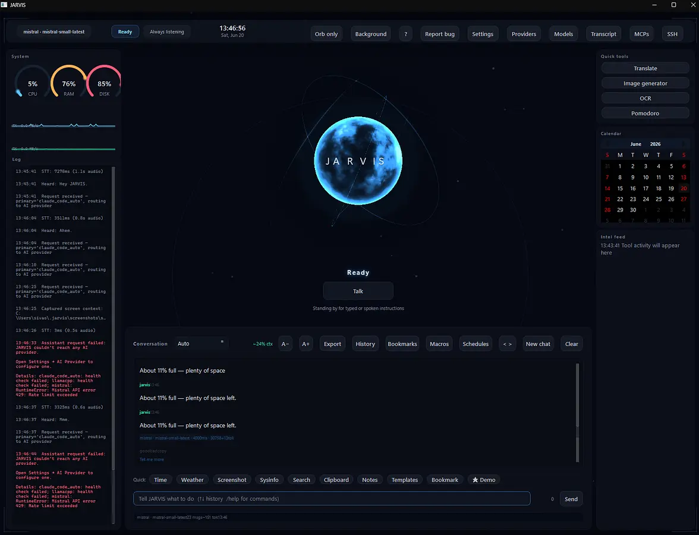

<div align="center">
(I tried to write as much of the main code myself but the installers, setup files and all are pretty much ai because Im not really good in that field. I tried to limit my use as much as possible.)
# JARVIS

Voice assistant for windows 11 inspired from Iron Man. Conversational with voice meaning you can talk to it for feedback, also has various plugins and features for round use by users.

[](https://github.com/ONEPUNCHMAN411/Jarvis/releases/latest)
[](https://python.org)
[](LICENSE)



**[Download v1 for Windows 11](https://github.com/ONEPUNCHMAN411/Jarvis/releases/latest)**

</div>

---

## What you need

- Windows 11 (may work on windows 10 not tested)
- Python 3.12+ (expect installer to fail without this)
- 8 GB RAM (16 if you want local models and chrome tabs) (GPU with at least 4 GB VRAM recommended if you want the fast response)
- An API key for at least one provider (Groq is free, gemini is free, mistral free) anything works

---

## Install

Installer is about 2gb but it has cuda so thats reasonable

**[JARVIS-Setup-v1.exe](https://github.com/ONEPUNCHMAN411/Jarvis/releases/latest)**

Or from source:

```bash
git clone https://github.com/ONEPUNCHMAN411/Jarvis.git
cd Jarvis
pip install -e .
python -m jarvis
```

First launch runs a setup wizard choose your options, get an api key and start using!

---

## What it does

- Conversational voice and feedback meaning its just like a human but AI!
- Full desktop control automation meaning it can click, zoom, type and do much more for your tasks!
- Playwright browser automation meaning it can read sites and gather data
- 50+ built-in tools covering web search, file management, system info, news, and much more
- Plugins for Gmail, Google Calendar, task scheduling, and more
- Switch providers easily by enabling/disabing providers
- Wake word detection if you install openwakeword (experimental, works fine with a decent USB mic but unreliable with a laptop mic)

---

## Providers

Lots of choices for providers

- Grok: Free and uses llama 70B
- Gemini: Free but hard to get api (buggy)
- Mistral: free but small model (7b) and rate limits
- Claude: Pay as you go, high quality
- OpenAI Pay as you go, high quality
---

## How it works

Voice runs faster whisper (with options to change to medium and high whisper) with Silero VAD gating it. With it, transcription only runs when someone's actually talking and doesent detect random background noise

Computer control goes through the Windows UI Automation accessibility tree instead of pixel coordinates. Most LLMs can't see your screen, they need structured data about what's in each window. The accessibility tree gives that without needing a vision model. Vision is still available as a fallback if the tree doesn't expose what you need.

The orb is a 3d sphere with GLSL. It was running at 60fps with 4x MSAA and 5 noise octaves, which ate GPU headroom the STT model needed and was very buggy. Dropped to 25fps, 2x MSAA, 3 octaves. Still looks the same, uses a fraction of the compute (though it doesent look as smooth).

Provider routing tries your primary, falls back down a configured chain when the health check fails. So if Groq rate limits you it moves to the next provider instead of throwing an error. (if all providers fail, expect the orb to not move when you talk)

---

## Config

Most settings live in the Settings panel inside the app. Others panels like mcp, ssh, do exist for extra configuration. (If you have any configuration questions please fill out the report bug form and send it to me on slack or via my email for github) For the few things not exposed there, the base config is at `config/default.yaml` inside the install folder. The app also writes runtime settings to `%USERPROFILE%\.jarvis\settings.json`.

```yaml
# config/default.yaml - notable options
voice:
  stt_model: "tiny.en"     # medium.en is noticeably better, also noticeably slower
  wake_word: "hey jarvis"

ai:
  primary_provider: "groq"
  temperature: 0.7
```

---

## Keyboard shortcuts

| Shortcut | Action |
|----------|--------|
| `Ctrl+Shift+J` | Open JARVIS from anywhere |
| `Ctrl+K` | Command palette |
| `Ctrl+F` | Search chat |
| `Ctrl+Enter` | Send message |
| `↑` / `↓` | Input history |

---


## Build

```bash
python build_exe.py
# outputs dist/JARVIS.exe (~1.8 GB with CUDA sometimes bigger depending on version)
```

---

## Credits

- [faster-whisper](https://github.com/SYSTRAN/faster-whisper): CTranslate2 Whisper inference
- [Silero VAD](https://github.com/snakers4/silero-vad): voice activity detection
- [Playwright](https://playwright.dev): browser automation
- [pywinauto](https://github.com/pywinauto/pywinauto): Windows UI Automation
- [edge-tts](https://github.com/rany2/edge-tts): text to speech

---

MIT License. Built for [Hack Club Stardance](https://stardance.hackclub.com) by Venkata.M.


